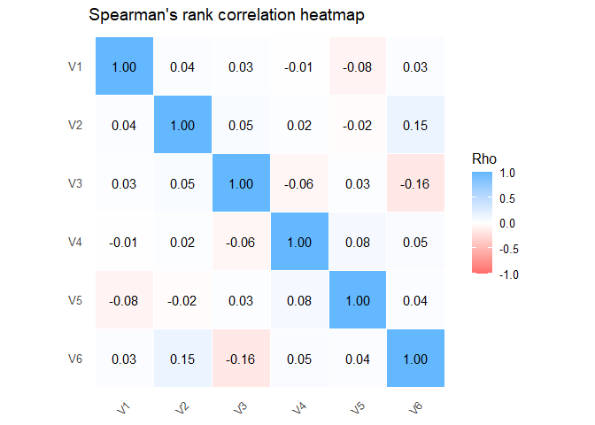
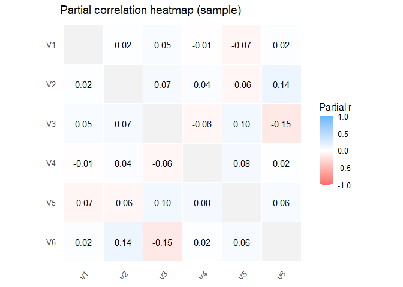
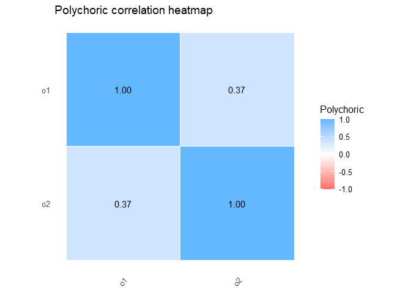
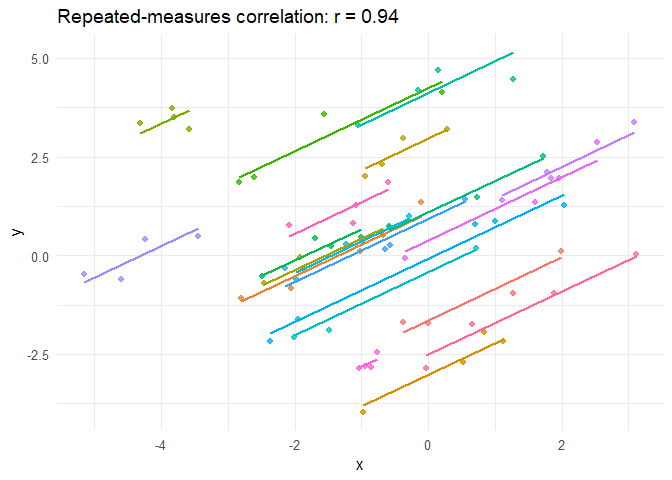
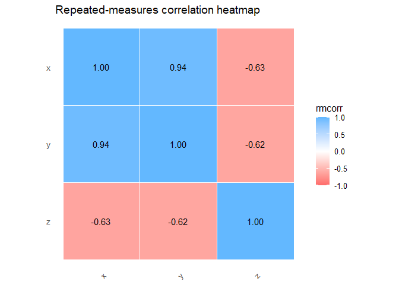
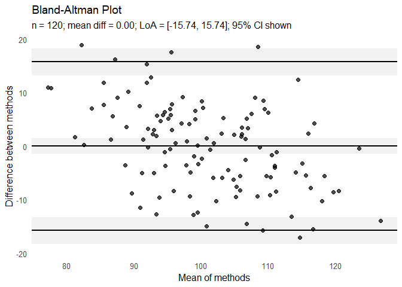
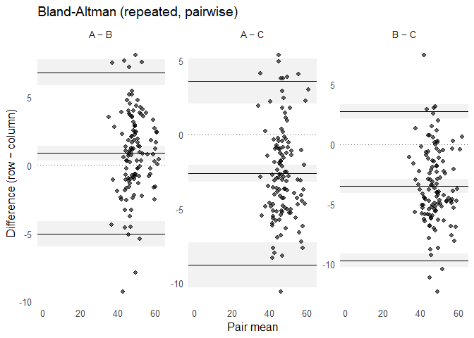
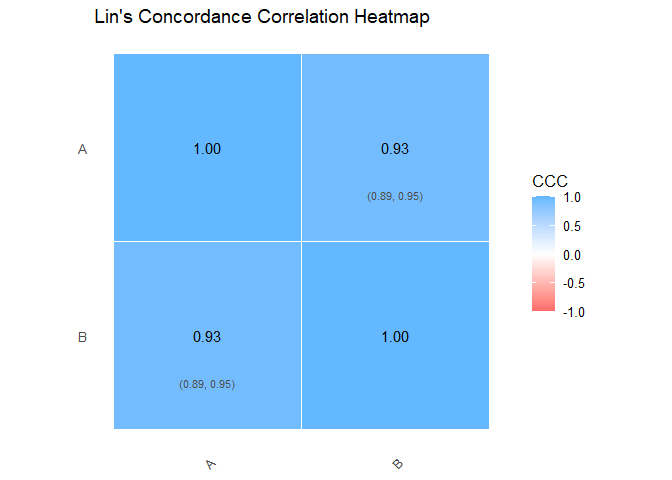
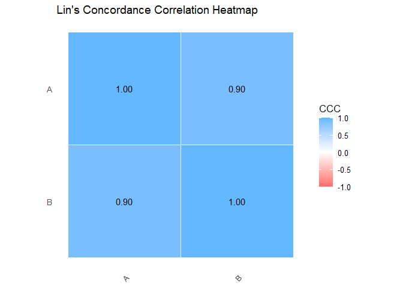

<!-- README.md is generated from README.Rmd. Please edit that file -->

# matrixCorr 

<!-- badges: start -->

[](https://CRAN.R-project.org/package=matrixCorr)

[](https://github.com/Prof-ThiagoOliveira/matrixCorr/actions/workflows/R-CMD-check.yaml)
[](https://github.com/Prof-ThiagoOliveira/matrixCorr/actions/workflows/test-coverage.yaml)
<!-- badges: end -->

`matrixCorr` computes correlation and related association matrices from
small to high-dimensional data using simple, consistent functions and
sensible defaults. It includes shrinkage and robust options for noisy or
**p \>= n** settings, plus convenient print/plot/summary methods.
Performance-critical paths are implemented in C++ with BLAS/OpenMP and
memory-aware symmetric updates. The API accepts base matrices and data
frames and returns standard R objects via a consistent S3 interface.

Contributions from other researchers who want to add new correlation
methods are very welcome. A central goal of `matrixCorr` is to keep
efficient correlation and agreement estimation in one package with a
common interface and consistent outputs, so methods can be extended,
compared, and used without repeated translation across packages.

Supported measures include Pearson, Spearman, Kendall, distance
correlation, partial correlation, robust biweight mid-correlation,
percentage bend, Winsorized, skipped correlation, and latent
categorical/ordinal correlations (tetrachoric, polychoric, polyserial,
and biserial), plus repeated-measures correlation (`rmcorr()`);
agreement tools cover Bland-Altman (two-method and repeated-measures)
and Lin’s concordance correlation coefficient (including
repeated-measures LMM/REML extensions).

## Features

- High-performance C++ backend using `Rcpp`
- General correlations such as `pearson_corr()`, `spearman_rho()`,
  `kendall_tau()`
- Robust correlation metrics (`bicor()`, `pbcor()`, `wincor()`,
  `skipped_corr()`)
- Distance correlation (`dcor()`)
- Partial correlation (`pcorr()`)
- Latent categorical/ordinal correlations (`tetrachoric()`,
  `polychoric()`, `polyserial()`, `biserial()`)
- Repeated-measures correlation (`rmcorr()`)
- Shrinkage for $p >> n$ (`schafer_corr()`)
- Agreement metrics
  - Bland-Altman (two-method `ba()` and repeated-measures `ba_rm()`),
  - Lin’s concordance correlation coefficient (pairwise `ccc()`,
    repeated-measures LMM/REML `ccc_rm_reml()` and non-parametric
    `ccc_rm_ustat()`)
- Interactive Shiny viewers for matrix-style outputs with a dedicated
  repeated-measures correlation viewer (`view_rmcorr_shiny()`)

## Installation

``` r
# Install from CRAN
install.packages("matrixCorr")

# Development version from GitHub
# install.packages("remotes")
remotes::install_github("Prof-ThiagoOliveira/matrixCorr")
```

## Example

### Correlation matrices (Pearson, Spearman, Kendall)

``` r
library(matrixCorr)

set.seed(1)
X <- as.data.frame(matrix(rnorm(300 * 6), ncol = 6))
names(X) <- paste0("V", 1:6)

R_pear <- pearson_corr(X)
R_spr  <- spearman_rho(X)
R_ken  <- kendall_tau(X)

print(R_pear, digits = 2)
#> Pearson correlation matrix: 
#>       V1    V2    V3    V4    V5    V6
#> V1  1.00  0.02  0.04 -0.02 -0.07  0.01
#> V2  0.02  1.00  0.04  0.03 -0.05  0.13
#> V3  0.04  0.04  1.00 -0.06  0.08 -0.14
#> V4 -0.02  0.03 -0.06  1.00  0.07  0.03
#> V5 -0.07 -0.05  0.08  0.07  1.00  0.04
#> V6  0.01  0.13 -0.14  0.03  0.04  1.00
summary(R_pear)
#> Correlation summary:
#>   class      : pearson_corr
#>   method     : pearson
#>   dimensions : 6 x 6
#>   n_variables: 6
#>   n_pairs    : 15
#>   symmetric  : yes
#>   missing    : 0
#>   min        : -0.1410
#>   max        : 0.1272
plot(R_spr)   # heatmap
```



### Robust correlation (biweight mid-correlation)

``` r
set.seed(2)
Y <- X
# inject outliers
Y$V1[sample.int(nrow(Y), 8)] <- Y$V1[sample.int(nrow(Y), 8)] + 8

R_bicor <- bicor(Y)
print(R_bicor, digits = 2)
#> Biweight mid-correlation matrix (bicor): 
#>       V1    V2    V3    V4    V5    V6
#> V1  1.00  0.05  0.03 -0.02 -0.07  0.02
#> V2  0.05  1.00  0.05  0.03 -0.04  0.14
#> V3  0.03  0.05  1.00 -0.06  0.05 -0.16
#> V4 -0.02  0.03 -0.06  1.00  0.08  0.04
#> V5 -0.07 -0.04  0.05  0.08  1.00  0.05
#> V6  0.02  0.14 -0.16  0.04  0.05  1.00
```

### Other robust correlations

``` r
R_pb   <- pbcor(Y)
R_win  <- wincor(Y)
R_skip <- skipped_corr(Y)

print(R_pb, digits = 2)
#> Percentage bend correlation matrix: 
#>       V1    V2    V3    V4    V5    V6
#> V1  1.00  0.03  0.02  0.01 -0.05  0.04
#> V2  0.03  1.00  0.06  0.02 -0.02  0.14
#> V3  0.02  0.06  1.00 -0.06  0.03 -0.16
#> V4  0.01  0.02 -0.06  1.00  0.07  0.05
#> V5 -0.05 -0.02  0.03  0.07  1.00  0.05
#> V6  0.04  0.14 -0.16  0.05  0.05  1.00
```

`skipped_corr()` is typically slower than `pbcor()` and `wincor()`
because it performs pairwise bivariate outlier detection before
computing the final correlation.

### High-dimensional shrinkage correlation ($p >> n$)

``` r
set.seed(3)
n <- 60; p <- 200
Xd <- matrix(rnorm(n * p), n, p)
colnames(Xd) <- paste0("G", seq_len(p))

R_shr <- schafer_corr(Xd)
print(R_shr, digits = 2, max_rows = 6, max_cols = 6)
#> Schafer-Strimmer shrinkage correlation matrix: 
#>       G1    G2 G3 G4 G5 G6
#> G1  1.00 -0.01  0  0  0  0
#> G2 -0.01  1.00  0  0  0  0
#> G3  0.00  0.00  1  0  0  0
#> G4  0.00  0.00  0  1  0  0
#> G5  0.00  0.00  0  0  1  0
#> G6  0.00  0.00  0  0  0  1
#> ... omitted: 194 rows, 194 cols
summary(R_shr)
#> Correlation summary:
#>   class      : schafer_corr
#>   method     : schafer_shrinkage
#>   dimensions : 200 x 200
#>   n_variables: 200
#>   n_pairs    : 19900
#>   symmetric  : yes
#>   missing    : 0
#>   min        : -0.0144
#>   max        : 0.0130
```

### Partial correlation matrix

``` r
R_part <- pcorr(X)
print(R_part, digits = 2)
#> Partial correlation (sample covariance)
#>       V1    V2    V3    V4    V5    V6
#> V1  1.00  0.02  0.05 -0.01 -0.07  0.02
#> V2  0.02  1.00  0.07  0.04 -0.06  0.14
#> V3  0.05  0.07  1.00 -0.06  0.10 -0.15
#> V4 -0.01  0.04 -0.06  1.00  0.08  0.02
#> V5 -0.07 -0.06  0.10  0.08  1.00  0.06
#> V6  0.02  0.14 -0.15  0.02  0.06  1.00
summary(R_part)
#> Correlation summary:
#>   class      : partial_corr
#>   method     : sample
#>   jitter     : 0
#>   dimensions : 6 x 6
#>   n_variables: 6
#>   n_pairs    : 15
#>   symmetric  : yes
#>   missing    : 0
#>   min        : -0.1518
#>   max        : 0.1368
plot(R_part)
```



`pcorr()` defaults to the sample partial correlation and also supports
`method = "oas"`, `method = "ridge"`, and `method = "glasso"` for
regularized estimation.

### Distance correlation matrix

``` r
R_dcor <- dcor(X)
print(R_dcor, digits = 2)
#> Distance correlation (dCor) matrix: 
#>    V1   V2   V3 V4 V5   V6
#> V1  1 0.00 0.00  0  0 0.00
#> V2  0 1.00 0.00  0  0 0.02
#> V3  0 0.00 1.00  0  0 0.02
#> V4  0 0.00 0.00  1  0 0.00
#> V5  0 0.00 0.00  0  1 0.00
#> V6  0 0.02 0.02  0  0 1.00
```

`dcor()` uses an unbiased estimator with a fast univariate $O(n \log n)$
dispatch and an exact $O(n^2)$ fallback for robustness.

### Latent categorical and ordinal correlations

``` r
set.seed(8)
n <- 800
Sigma_lat <- matrix(c(
  1.00, 0.55, 0.35, 0.20,
  0.55, 1.00, 0.40, 0.25,
  0.35, 0.40, 1.00, 0.45,
  0.20, 0.25, 0.45, 1.00
), 4, 4, byrow = TRUE)

Z <- matrix(rnorm(n * 4), n, 4) %*% chol(Sigma_lat)

X_bin <- data.frame(
  b1 = Z[, 1] > qnorm(0.70),
  b2 = Z[, 2] > qnorm(0.55),
  b3 = Z[, 3] > qnorm(0.50)
)

X_ord <- data.frame(
  o1 = ordered(cut(Z[, 2], breaks = c(-Inf, -0.5, 0.4, Inf),
                   labels = c("low", "mid", "high"))),
  o2 = ordered(cut(Z[, 3], breaks = c(-Inf, -1, 0, 1, Inf),
                   labels = c("1", "2", "3", "4")))
)

X_cont <- data.frame(x1 = Z[, 1], x2 = Z[, 4])

R_tet <- tetrachoric(X_bin)
R_pol <- polychoric(X_ord)
R_ps  <- polyserial(X_cont, X_ord)
R_bis <- biserial(X_cont, X_bin[, 1:2])

print(R_tet, digits = 2)
#> Tetrachoric correlation matrix: 
#>      b1   b2   b3
#> b1 1.00 0.55 0.39
#> b2 0.55 1.00 0.33
#> b3 0.39 0.33 1.00
summary(R_ps)
#> Latent correlation summary:
#>   class      : polyserial_corr
#>   method     : polyserial
#>   dimensions : 2 x 2
#>   n_pairs    : 4
#>   symmetric  : no
#>   missing    : 0
#>   min        : 0.2298
#>   max        : 0.5523
plot(R_pol)
```



### Repeated-measures correlation

``` r
set.seed(2026)
n_subjects <- 20
n_rep <- 4
subject <- rep(seq_len(n_subjects), each = n_rep)
subj_eff_x <- rnorm(n_subjects, sd = 1.5)
subj_eff_y <- rnorm(n_subjects, sd = 2.0)
within_signal <- rnorm(n_subjects * n_rep)

dat_rm <- data.frame(
  subject = subject,
  x = subj_eff_x[subject] + within_signal + rnorm(n_subjects * n_rep, sd = 0.2),
  y = subj_eff_y[subject] + 0.8 * within_signal + rnorm(n_subjects * n_rep, sd = 0.3),
  z = subj_eff_y[subject] - 0.4 * within_signal + rnorm(n_subjects * n_rep, sd = 0.4)
)

fit_xy <- rmcorr(dat_rm, response = c("x", "y"), subject = "subject")
fit_mat <- rmcorr(dat_rm, response = c("x", "y", "z"), subject = "subject")

print(fit_xy)
#> Repeated-measures correlation:
#>   responses : x vs y
#>   based.on  : 80
#>   subjects  : 20
#>   df        : 59
#>   r         : 0.9448
#>   slope     : 0.7991
#>   p_value   : 2.769e-30
#>   CI 95.0%   : [0.9094, 0.9667]
print(fit_mat, digits = 2)
#> Repeated-measures correlation matrix: 
#>       x     y     z
#> x  1.00  0.94 -0.63
#> y  0.94  1.00 -0.62
#> z -0.63 -0.62  1.00
plot(fit_xy)
```



``` r
plot(fit_mat)
```



``` r

# Dedicated Shiny viewer for repeated-measures correlation matrices
# if (interactive() && requireNamespace("shiny", quietly = TRUE)) {
#   fit_mat_view <- rmcorr(
#     dat_rm,
#     response = c("x", "y", "z"),
#     subject = "subject",
#     keep_data = TRUE
#   )
#   view_rmcorr_shiny(fit_mat_view)
# }
```

## Agreement analyses

Here we look at agreement analyses for Bland-Altman and
repeated-measures concordance workflows.

### Two-method Bland-Altman

``` r
set.seed(4)
x <- rnorm(120, 100, 10)
y <- x + 0.5 + rnorm(120, 0, 8)

ba_fit <- ba(x, y)
print(ba_fit)
#> Bland-Altman (n = 120) - LoA = mean +/- 1.96 * SD, 95% CI
#> 
#>  quantity        estimate lwr     upr    
#>  Mean difference 0.001    -1.450  1.453  
#>  Lower LoA       -15.741  -18.255 -13.226
#>  Upper LoA       15.743   13.229  18.258 
#> 
#> SD(differences): 8.032   LoA width: 31.484
summary(ba_fit)
#> Bland-Altman (two methods), 95% CI
#> 
#> Agreement estimates
#> 
#>  n   bias  sd_loa loa_low loa_up width  loa_multiplier
#>  120 0.001 8.032  -15.741 15.743 31.484 1.96          
#> 
#> Confidence intervals
#> 
#>  bias_lwr bias_upr lo_lwr  lo_upr  up_lwr up_upr
#>  -1.45    1.453    -18.255 -13.226 13.229 18.258
plot(ba_fit)
```



### Repeated-measures Bland-Altman (pairwise matrix)

``` r
set.seed(5)
S <- 20; Tm <- 6
subj  <- rep(seq_len(S), each = Tm)
time  <- rep(seq_len(Tm), times = S)

true  <- rnorm(S, 50, 6)[subj] + (time - mean(time)) * 0.4
mA    <- true + rnorm(length(true), 0, 2)
mB    <- true + 1.0 + rnorm(length(true), 0, 2.2)
mC    <- 0.95 * true + rnorm(length(true), 0, 2.5)

dat <- rbind(
  data.frame(y = mA, subject = subj, method = "A", time = time),
  data.frame(y = mB, subject = subj, method = "B", time = time),
  data.frame(y = mC, subject = subj, method = "C", time = time)
)
dat$method <- factor(dat$method, levels = c("A","B","C"))

ba_rep <- ba_rm(
  data = dat, response = "y", subject = "subject",
  method = "method", time = "time",
  include_slope = FALSE, use_ar1 = FALSE
)
print(ba_rep)
#> Bland-Altman (row − column), 95% CI
#> 
#>  method1 method2 bias   sd_loa loa_low loa_up width  n  
#>  A       B        0.875 3.021  -5.045  6.796  11.841 120
#>  A       C       -2.609 3.156  -8.795  3.577  12.372 120
#>  B       C       -3.484 3.167  -9.692  2.724  12.416 120
summary(ba_rep)
#> Bland-Altman (pairwise), 95% CI
#> 
#> Agreement estimates
#> 
#>  method1 method2 n   bias   sd_loa loa_low loa_up width 
#>  A       B       120  0.875 3.021  -5.045  6.796  11.841
#>  A       C       120 -2.609 3.156  -8.795  3.577  12.372
#>  B       C       120 -3.484 3.167  -9.692  2.724  12.416
#> 
#> Confidence intervals
#> 
#>  bias_lwr bias_upr lo_lwr  lo_upr up_lwr up_upr
#>   0.335    1.416    -5.996 -4.094 5.845  7.747 
#>  -3.173   -2.044   -10.313 -7.276 2.059  5.095 
#>  -4.051   -2.918   -10.259 -9.126 2.157  3.291 
#> 
#> Model details
#> 
#>  sigma2_subject sigma2_resid residual_model
#>  0               9.124       iid           
#>  0               9.960       iid           
#>  0              10.032       iid
plot(ba_rep)
```



### Lin’s concordance correlation coefficient

``` r
set.seed(6)
x <- rnorm(80, 100, 8)
y <- x + 0.4 + rnorm(80, 0, 3)

fit_ccc <- ccc(data.frame(A = x, B = y), ci = TRUE)
print(fit_ccc)
#> Concordance pairs (Lin's CCC, 95% CI)
#> 
#>  method1 method2 estimate lwr    upr   
#>  A       B       0.9262   0.8877 0.9519
summary(fit_ccc)
#> Concordance pairs (Lin's CCC, 95% CI)
#> 
#>  method1 method2 estimate lwr  upr 
#>  A       B       0.9262   0.89 0.95
plot(fit_ccc)
```



Use `ccc_rm_ustat()` when you have repeated measurements on the same
subjects across methods and want a direct non-parametric
repeated-measures CCC. Use `ccc_rm_reml()` when you want a model-based
estimate from variance components, especially when subject effects, time
effects, or within-subject correlation need to be modeled explicitly.

### Repeated-measures Lin’s concordance correlation coefficient (LMM/REML)

``` r
set.seed(6)
S <- 30; Tm <- 8
id     <- factor(rep(seq_len(S), each = 2 * Tm))
method <- factor(rep(rep(c("A","B"), each = Tm), times = S))
time   <- rep(rep(seq_len(Tm), times = 2), times = S)

u  <- rnorm(S, 0, 0.8)[as.integer(id)]
g  <- rnorm(S * Tm, 0, 0.5)
g  <- g[(as.integer(id) - 1L) * Tm + as.integer(time)]
y  <- (method == "B") * 0.3 + u + g + rnorm(length(id), 0, 0.7)

dat_ccc <- data.frame(y, id, method, time)
fit_ccc_rm <- ccc_rm_reml(dat_ccc, response = "y", rind = "id",
                          method = "method", time = "time")
print(fit_ccc_rm)
#> Concordance pairs (Lin's CCC)
#> 
#>  method1 method2 estimate
#>  A       B       0.8987
summary(fit_ccc_rm)  # overall CCC, variance components, SEs/CI
#> Repeated-measures concordance (REML)
#> 
#> Concordance estimates
#> 
#>  method1 method2 estimate SB     se_ccc
#>  A       B       0.8987   0.0427 0.0172
#> 
#> Variance components
#> 
#>  sigma2_subject sigma2_subject_method sigma2_subject_time sigma2_error
#>  0.8149         0                     0.2965              0.4267      
#> 
#> AR(1) diagnostics
#> 
#>  ar1_rho ar1_rho_lag1 ar1_rho_mom ar1_pairs ar1_pval use_ar1 ar1_recommend
#>  -0.0533 -0.0533      -0.0533     420       0.2747   FALSE   FALSE
plot(fit_ccc_rm)
```



## Contributing

Issues and pull requests are welcome. Please see `CONTRIBUTING.md` for
guidelines and `cran-comments.md`/`DESCRIPTION` for package metadata.

## License

MIT [Thiago de Paula Oliveira](https://orcid.org/0000-0002-4555-2584)

See inst/LICENSE for the full MIT license text.
